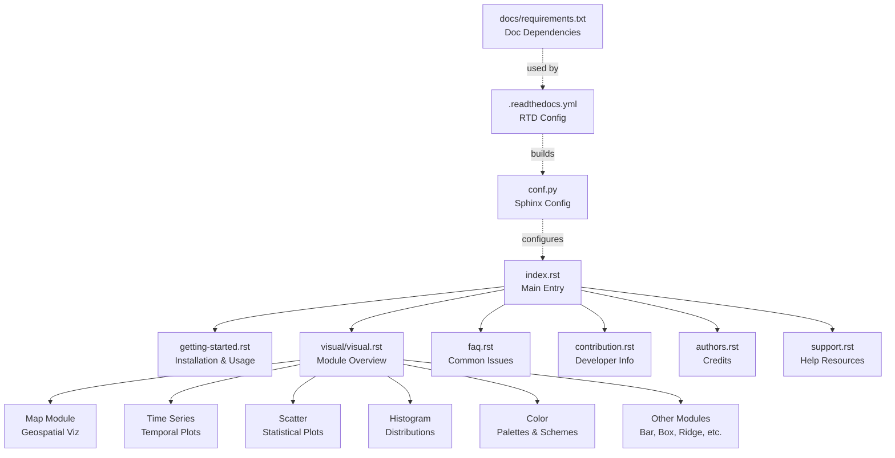
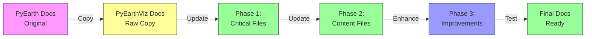
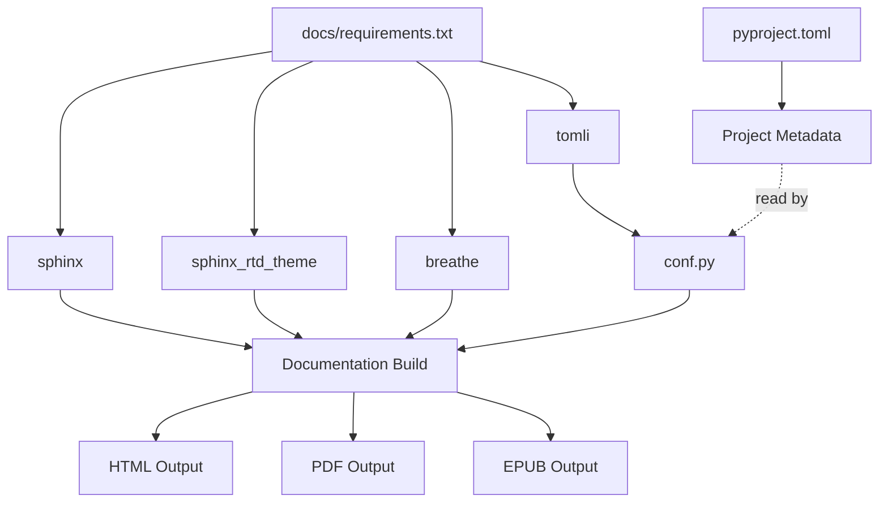
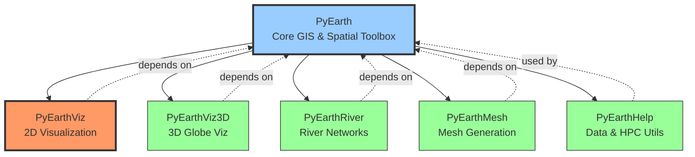

# PyEarthViz Documentation Structure

## Documentation Architecture



## File Update Workflow



## Module Coverage in Documentation

### Current PyEarthViz Modules

| Module | Description | Doc Status |
|--------|-------------|------------|
| **animate** | Polygon animation over time | Listed in visual.rst |
| **barplot** | Bar chart visualizations | Listed in visual.rst |
| **boxplot** | Box plot distributions | Listed in visual.rst |
| **color** | Color scheme utilities | Listed in visual.rst |
| **histogram** | Distribution histograms | Listed in visual.rst |
| **ladder** | Ladder plot for discrete data | Listed in visual.rst |
| **map** | Geospatial mapping (raster/vector) | Listed in visual.rst |
| **ridgeplot** | Ridge plots for distributions | Listed in visual.rst |
| **scatter** | Scatter plots with density | Listed in visual.rst |
| **surface** | Surface plots (placeholder) | Not documented |
| **timeseries** | Temporal data visualization | Listed in visual.rst |

### Recommended Documentation Expansion

1. **API Reference** - Auto-generated from docstrings
2. **Example Gallery** - Visual examples for each module
3. **User Guide** - Step-by-step tutorials
4. **Migration Guide** - For users transitioning from PyEarth

## Build Dependencies



## PyEarthSuite Ecosystem Context



## Update Checklist by Priority

### Phase 1: Critical Configuration (Required for Build)
- [ ] `docs/source/conf.py` - Update all pyearth → pyearthviz references
- [ ] `docs/source/index.rst` - Main documentation entry point
- [ ] `docs/source/getting-started.rst` - Installation and import examples

### Phase 2: Content Updates (Required for Accuracy)
- [ ] `docs/source/support.rst` - Fix GitHub issue URL
- [ ] `docs/source/contribution.rst` - Update package name
- [ ] `docs/source/faq.rst` - Update content for visualization focus

### Phase 3: Enhancements (Nice to Have)
- [ ] `docs/source/visual/visual.rst` - Expand module documentation
- [ ] Add `docs/source/api.rst` - API reference
- [ ] Add `docs/source/examples.rst` - Example gallery

## Testing Strategy

1. **Local Build Test**
   ```bash
   cd docs
   make clean && make html
   ```

2. **Link Validation**
   ```bash
   make linkcheck
   ```

3. **Visual Inspection**
   - Open `docs/_build/html/index.html`
   - Check navigation structure
   - Verify all internal links work
   - Confirm external links point to pyearthviz

4. **ReadTheDocs Integration**
   - Push to GitHub
   - Monitor RTD build at https://readthedocs.org/projects/pyearthviz/
   - Review live docs at https://pyearthviz.readthedocs.io

## Key Changes Summary

| File | Old Reference | New Reference |
|------|---------------|---------------|
| conf.py | project = "pyearth" | project = "pyearthviz" |
| conf.py | input_dir = "../../pyearth" | input_dir = "../../pyearthviz" |
| conf.py | breathe_projects["pyearth"] | breathe_projects["pyearthviz"] |
| index.rst | Welcome to pyearth | Welcome to PyEarthViz |
| getting-started.rst | pip install pyearth | pip install pyearthviz |
| getting-started.rst | import pyearth | import pyearthviz |
| support.rst | pyflowline/issues | pyearthviz/issues |
| contribution.rst | PyEarth was developed | PyEarthViz is developed |
| faq.rst | model output questions | visualization questions |

