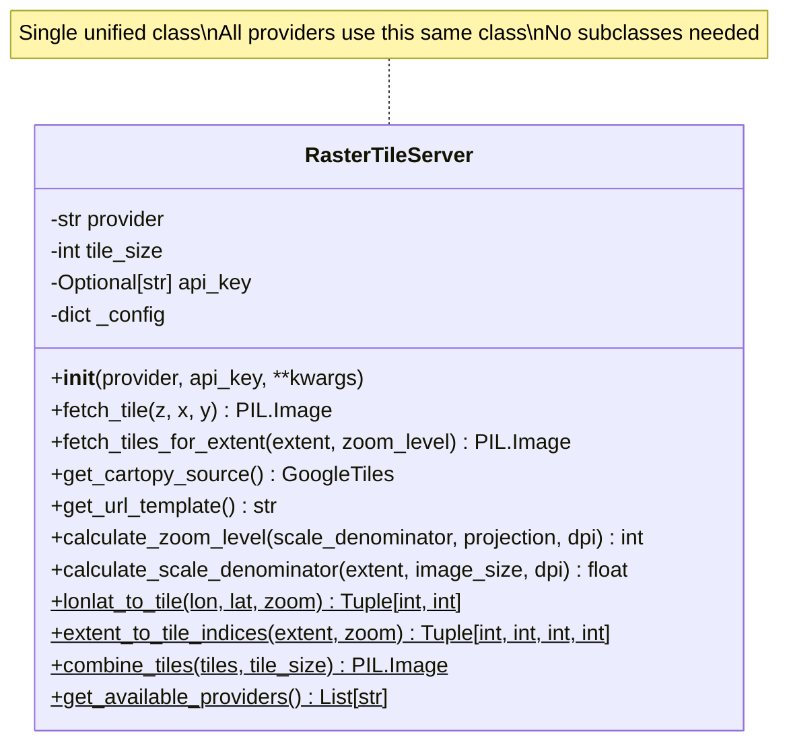
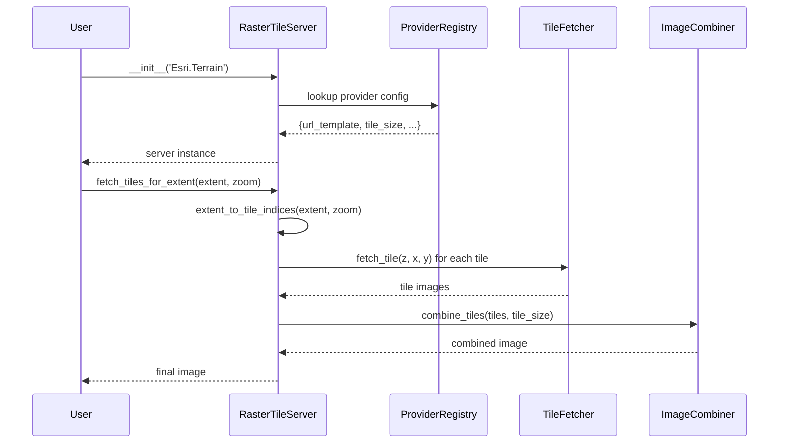
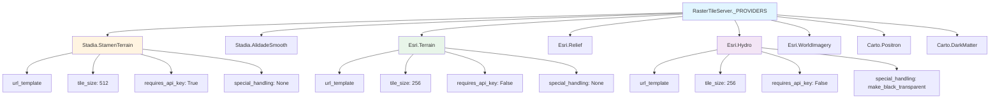
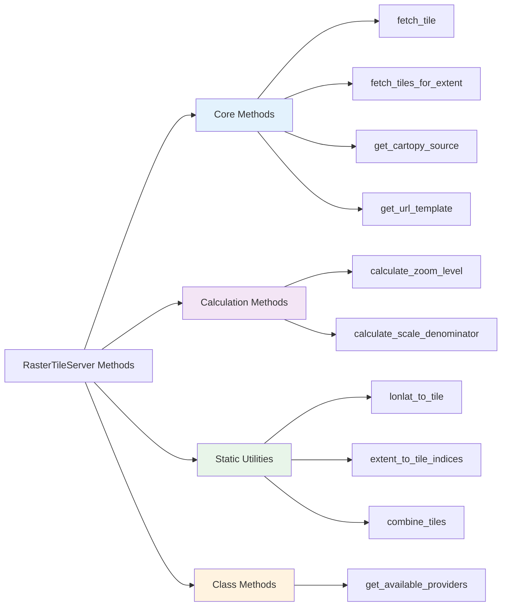
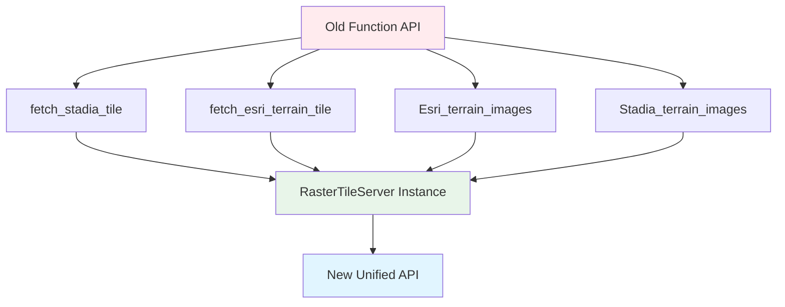
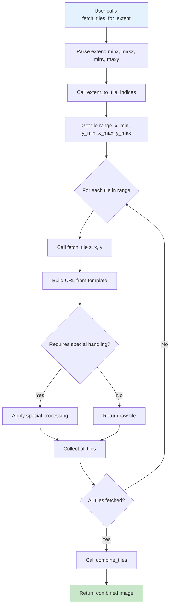
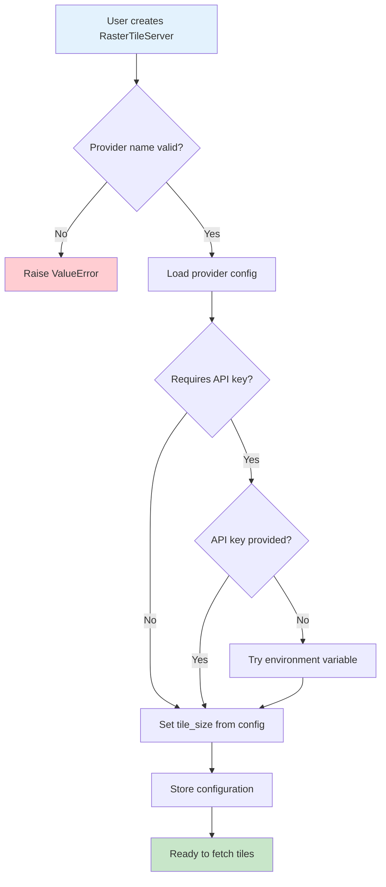
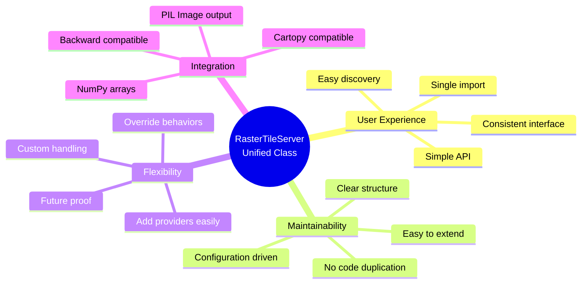

# RasterTileServer Architecture Diagram

## Class Structure



## Usage Flow



## Provider Registry Structure



## Method Organization



## Backward Compatibility Layer



## Data Flow: Fetching Tiles for Extent



## Provider Selection Flow



## Key Design Benefits



## Example Usage Comparison

### Old API
```python
# Different functions for each provider
from pyearthviz.map.map_servers import (
    fetch_stadia_tile,
    fetch_esri_terrain_tile,
    Stadia_terrain_images,
    Esri_terrain_images
)

# Fetch single tile - different function names
stadia_tile = fetch_stadia_tile(z, x, y)
esri_tile = fetch_esri_terrain_tile(z, x, y)

# Fetch extent - different function names
stadia_img = Stadia_terrain_images(extent, zoom)
esri_img = Esri_terrain_images(extent, zoom)
```

### New API
```python
# Single class for everything
from pyearthviz.map.map_servers import RasterTileServer

# Fetch single tile - same method name
stadia = RasterTileServer('Stadia.StamenTerrain', api_key='key')
stadia_tile = stadia.fetch_tile(z, x, y)

esri = RasterTileServer('Esri.Terrain')
esri_tile = esri.fetch_tile(z, x, y)

# Fetch extent - same method name
stadia_img = stadia.fetch_tiles_for_extent(extent, zoom)
esri_img = esri.fetch_tiles_for_extent(extent, zoom)
```

**Result:** Simpler, more consistent, and easier to discover!
